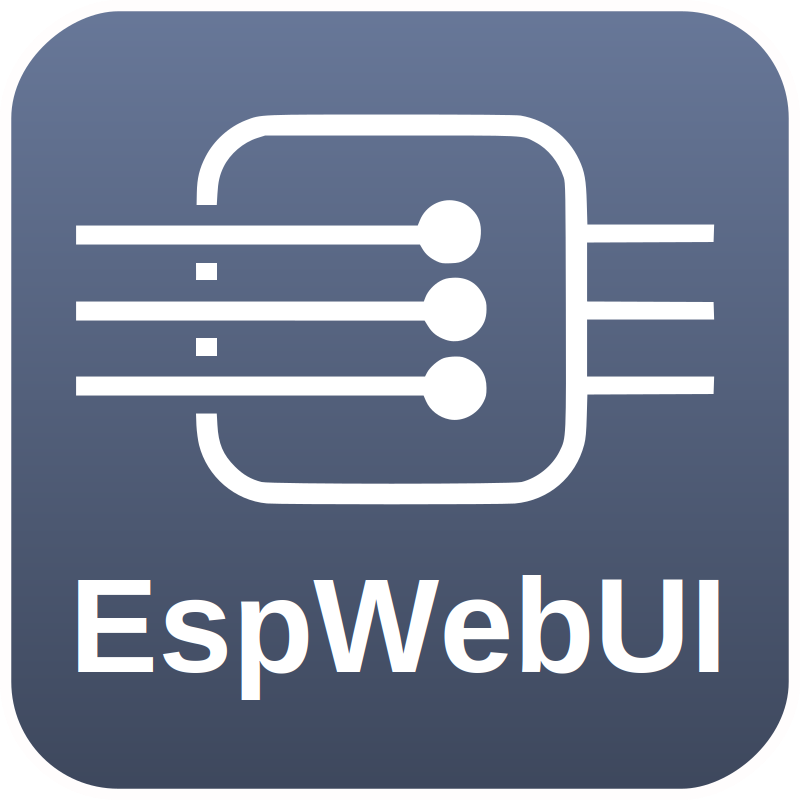

<h3 style="text-align: center;">EspWebUI-Template</h3>

-----

-----

If you like this project, feel free to push the <b>[Star ⭐️]</b> button and click <b>[Watch 👁]</b> to stay updated.
  
And if you'd like to support my work, you can also

-----

# EspWebUI-Template

## :construction:  
under construction...